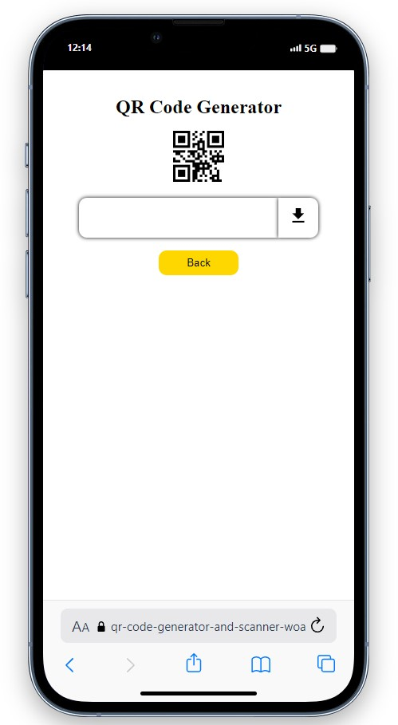
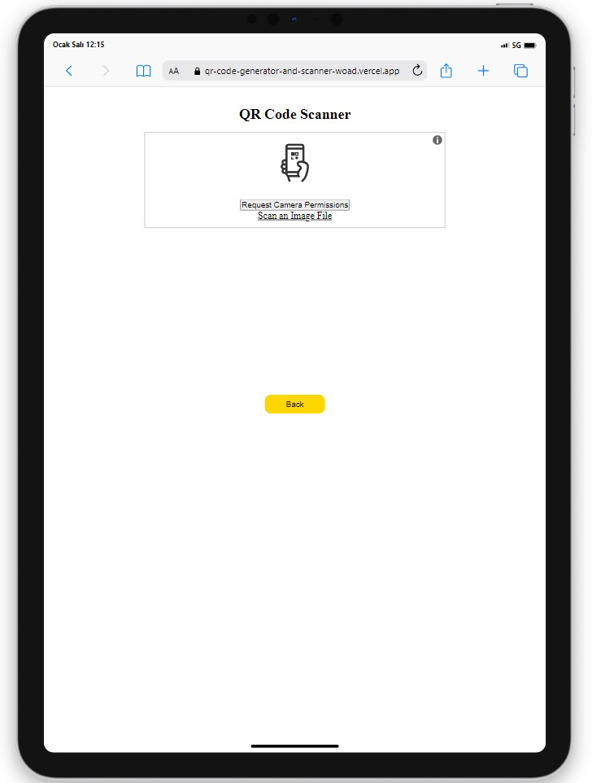
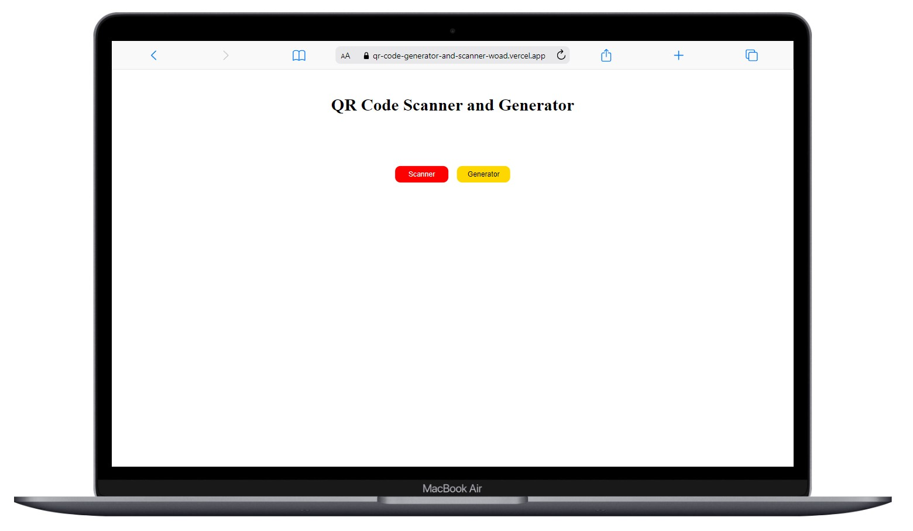

# QR Code Generator and Scanner

<div align="center">
  
</div>

## About the Project

The project I created with React includes a web application that allows users to generate QR codes and scan them to read information.

## Live Demo

[QR Code Generator and Scanner](https://qr-code-generator-and-scanner-woad.vercel.app/)


## Usage

### Scanning a QR Code
- On the main page, click on the 'Scanner' option.
- Direct your camera towards the QR code.
- Once the code is scanned, the relevant information will be displayed.

### Creating a QR Code
- On the main page, click on the 'Generator' option.
- Enter the required information (e.g., text, link, or other data types).
- Obtain the QR code by clicking the 'Download' button

## Technologies Used

- React
- React-Router-Dom
- Icons from [React Icons](https://react-icons.github.io/react-icons/)
- [Sweetalert2](https://sweetalert2.github.io/) for alert 
- [html5-qrcode](https://www.npmjs.com/package/html5-qrcode) for the scanning
- [react-qr-code](https://www.npmjs.com/package/react-qr-code) for the creating


## Project Skeleton

```
QR Code Generator and Scanner (folder)
|
|----readme.md         
SOLUTION
├── public
│    └── index.html
├── src
│    ├── assets
│    │     └── [images]
│    ├── components
│    │     ├── Generator.jsx
│    │     └── Scanner.jsx
│    ├── pages
│    │     └── Home.jsx
│    ├── router
│    │     └── router.js
│    ├── App.js
│    ├── index.css
│    └── index.js
├── package.json
└── yarn.lock
```

## Screenshots

<div align="center">
  
  
  
</div>

## Compatibility

The project is compatible with both wide-screen computers and mobile devices.